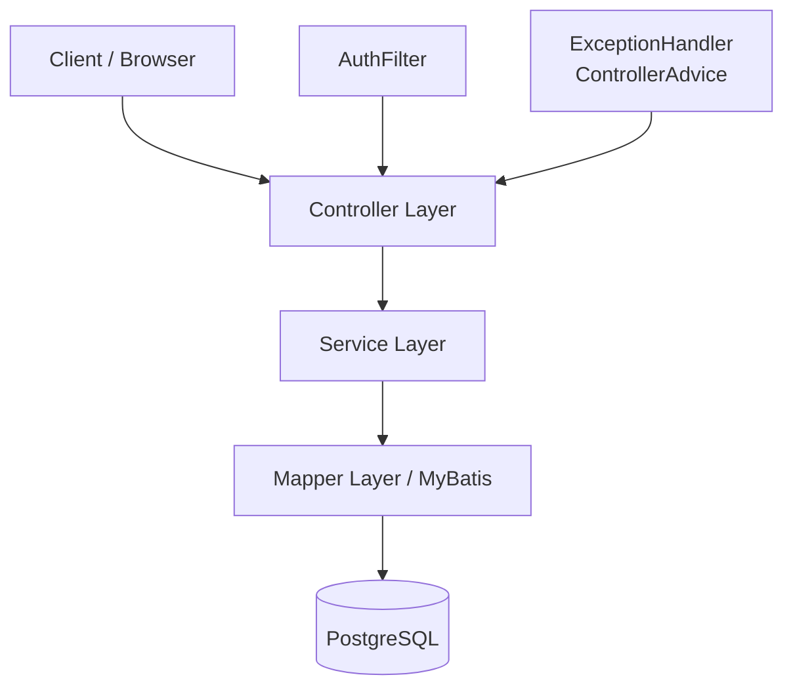
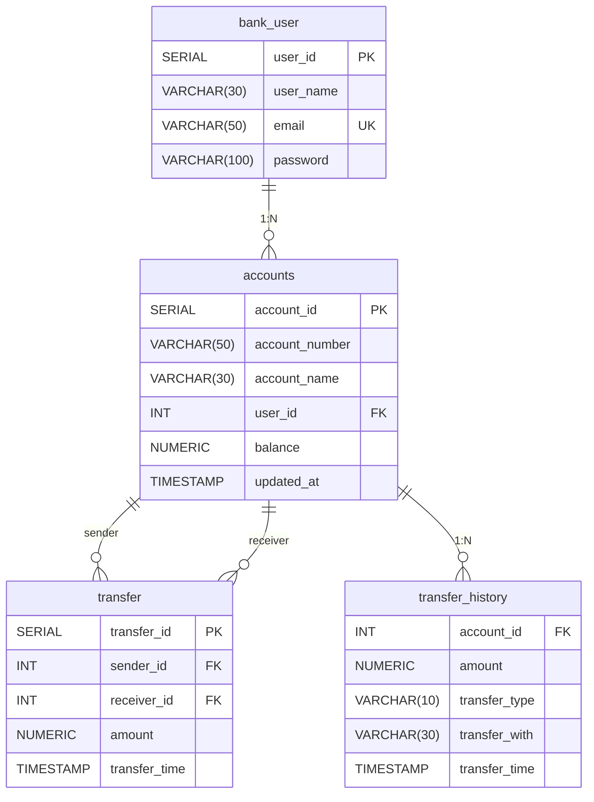

# 🏦 Bank Project

> Spring Boot ベースのバンキングWebアプリケーション

---

## 📋 プロジェクト概要

ユーザーにシームレスなバンキング体験を提供するために設計されたSpring Bootアプリケーションです。

### 主な機能
- **ユーザー登録・認証** — BCryptによるパスワード暗号化、セッションベースの認証管理
- **口座管理** — 口座の作成、残高確認、一覧表示（ページネーション対応）
- **口座間送金** — synchronized方式 + 悲観的ロック（Pessimistic Lock）による同時実行制御
- **取引履歴** — 送金・入金履歴の閲覧（ページネーション対応）
- **エラーハンドリング** — `@ControllerAdvice`による一括例外処理

---

## 🏗️ アーキテクチャ

```
com.bank_project
├── config/             # SecurityConfig, FilterConfig
├── controller/         # AuthController, AccountController, AppController
├── service/            # AuthService, AccountService, TransferService
├── mapper/             # UserMapper, AccountMapper, TransferMapper, HistoryMapper
├── vo/                 # Entity（User, Account, Transfer, TransferHistory）
│   └── dto/            # TransferDTO, PagedResult, PagingDTO
├── filter/             # AuthFilter（セッション認証フィルタ）
├── error/              # ExceptionHandlerController, カスタム例外クラス
└── helpers/            # GenAccountNumber（口座番号生成ユーティリティ）
```

### レイヤード・アーキテクチャ



---

## 🛠️ 使用技術

| カテゴリ | 技術スタック |
|---------|-------------|
| 言語 | Java 17 |
| フレームワーク | Spring Boot 4.0.2 |
| セキュリティ | Spring Security（BCryptPasswordEncoder） |
| ORM | MyBatis（mybatis-spring-boot-starter 4.0.1） |
| データベース | PostgreSQL |
| テンプレートエンジン | Thymeleaf |
| フロントエンド | HTML, Bootstrap（CSS/JS） |
| ビルドツール | Maven |
| ライブラリ | Lombok |
| テスト | JUnit 5, AssertJ |

---

## 📡 API エンドポイント

### 認証（Auth）

| メソッド | エンドポイント | 説明 |
|---------|--------------|------|
| `GET`  | `/login` | ログインページ表示 |
| `POST` | `/login` | ログイン処理（email, password） |
| `GET`  | `/register` | 会員登録ページ表示 |
| `POST` | `/register` | 会員登録処理（user_name, email, password） |
| `POST` | `/logout` | ログアウト（セッション無効化） |

### 口座（Account）

| メソッド | エンドポイント | 説明 |
|---------|--------------|------|
| `POST` | `/account/createAccount` | 口座作成（account_name） |
| `POST` | `/account/{accountNumber}/transfer` | 口座間送金 |
| `GET`  | `/account/{accountId}/history` | 取引履歴照会（ページネーション対応） |

### ダッシュボード

| メソッド | エンドポイント | 説明 |
|---------|--------------|------|
| `GET`  | `/app/dashboard` | ユーザーダッシュボード（口座一覧表示） |

---

## 📊 ERD（Entity Relationship Diagram）



---

## 🔒 トランザクション・同時実行制御・悲観的ロック

送金処理において、データの整合性を保証するため**2種類のトランザクション制御方式**を実装しています。

### 1. synchronized方式（`sendMoney`）

```java
public synchronized void sendMoney(TransferDTO transferDTO) throws Exception {
    SqlSession sqlSession = sqlSessionFactory.openSession(false);
    // ... 送金ロジック
    sqlSession.commit();
}
```

- Javaの`synchronized`キーワードでメソッドレベルの排他制御を実現
- **単一JVMインスタンス**では安全だが、マルチインスタンス環境ではデータ競合の可能性あり
- 手動トランザクション管理（`SqlSession`による`commit` / `rollback`）

### 2. 悲観的ロック方式（`sendMoneyWithDBLock`）

```java
public void sendMoneyWithDBLock(TransferDTO transferDTO) throws Exception {
    // デッドロック防止のためID順でロック取得
    if (sender_id < receiver_id) {
        sender = accountMapper.findForUpdate(sender_id);   // SELECT ... FOR UPDATE
        receiver = accountMapper.findForUpdate(receiver_id);
    } else {
        receiver = accountMapper.findForUpdate(receiver_id);
        sender = accountMapper.findForUpdate(sender_id);
    }
    // ... 送金ロジック
}
```

- PostgreSQLの`SELECT ... FOR UPDATE`による行レベルロック
- **デッドロック防止策**: `account_id`の昇順でロックを取得し、循環待ちを回避
- マルチインスタンス環境でもデータ整合性を保証
- HikariCP接続プール（最大110接続、`auto-commit=false`）

### 方式比較

| 項目 | synchronized | 悲観的ロック（DB Lock） |
|------|-------------|----------------------|
| ロック範囲 | JVMプロセス内 | データベース行レベル |
| マルチインスタンス対応 | ❌ | ✅ |
| デッドロックリスク | なし | あり（ID順ロックで対策済み） |
| パフォーマンス | 高スループット（単一JVM） | DB I/O依存 |

---

## 🐛 トラブルシューティング

### 1. Circular View Path エラー
- **問題**: `/login`エンドポイントで「Circular view path [login]」エラーが発生
- **原因**: Controllerの`@RequestMapping`とThymeleafのビュー名が衝突し、無限リダイレクトが発生
- **解決策**: `@GetMapping`と`@PostMapping`を分離し、ビュー解決パスを明確化

### 2. セッション期限切れメッセージの初回表示問題
- **問題**: 初回ページロード時に「sessionExpired」メッセージが表示される
- **原因**: `AuthFilter`のセッション判定ロジックの不備
- **解決策**: セッションが存在しない場合（`session == null`）と、セッションが存在するがユーザー情報がない場合を分離して判定

### 3. 同時実行時のデータ不整合
- **問題**: 100スレッド×500回の並行送金テストで残高が不一致
- **原因**: `synchronized`メソッドだけでは、DB接続プール経由の並行アクセスで競合状態が発生
- **解決策**: `SELECT ... FOR UPDATE`による悲観的ロックの導入と、デッドロック防止のためのID順ロック取得

---

## ✅ テストコード・デバッグ・エラーハンドリング・ロギング

### テストコード

`BankProjectApplicationTests`クラスで以下のテストを実装：

| テストメソッド | 内容 |
|-------------|------|
| `testUserCreateAndTransfer` | synchronized方式の同時実行テスト（100スレッド × 500送金） |
| `testSendMoneyWithDBLock` | 悲観的ロック方式の同時実行テスト（100スレッド × 500送金） |
| `generateHash` | BCryptパスワードハッシュ生成テスト |

- **JUnit 5** + **AssertJ** によるアサーション
- `ExecutorService`と`CountDownLatch`を使用した並行処理テスト
- 送金前後の残高検証（初期: 90,000 / 10,000 → 期待値: 40,000 / 60,000）

### エラーハンドリング

`@ControllerAdvice`（`ExceptionHandlerController`）で例外を一括管理：

| 例外 | ハンドラ | 処理 |
|------|---------|------|
| `LoginException` | `handleLoginException` | `/login`へリダイレクト + フラッシュメッセージ |
| `RegisterException` | `handleEmailException` | `/register`へリダイレクト + フラッシュメッセージ |
| `RuntimeException` | `handleRuntimeException` | エラーページ表示 |
| `DataAccessException` | `handleDataAccessException` | DBエラーページ表示 |
| `NoHandlerFoundException` | `handle404` | 404エラーページ表示 |
| `Exception` | `handleAll` | 500エラーページ表示 |

### ロギング

- **SLF4J + Logback** によるログ出力
- 送金処理の開始・完了・エラーを記録
- 処理時間の計測（ミリ秒単位）
- Spring Framework のデバッグログ有効化（`logging.level.org.springframework=DEBUG`）

---

## 🚀 実行方法

### Maven で実行

```bash
# 1. リポジトリをクローン
git clone https://github.com/your-username/bank_project.git
cd bank_project

# 2. PostgreSQL データベースの作成
# bank_app という名前のデータベースを作成してください
createdb bank_app

# 3. データベース設定
# src/main/resources/application.properties を環境に合わせて編集
#   spring.datasource.url=jdbc:postgresql://localhost:5432/bank_app
#   spring.datasource.username=postgres
#   spring.datasource.password=postgres

# 4. プロジェクトのビルド
mvn clean install

# 5. アプリケーションの起動
mvn spring-boot:run
```

---

## 💻 使い方

1. Webブラウザで `http://127.0.0.1:8076/` にアクセス
2. **会員登録**（`/register`）でアカウントを作成
3. **ログイン**（`/login`）でダッシュボードに移動
4. **ダッシュボード**で口座を作成し、残高を管理
5. **送金**で他の口座に送金
6. **取引履歴**で過去の送金・入金記録を確認

---

## 📁 プロジェクト構成

```
bank_project/
├── pom.xml
├── src/
│   ├── main/
│   │   ├── java/com/bank_project/
│   │   │   ├── BankProjectApplication.java
│   │   │   ├── config/
│   │   │   │   ├── SecurityConfig.java
│   │   │   │   └── FilterConfig.java
│   │   │   ├── controller/
│   │   │   │   ├── AuthController.java
│   │   │   │   ├── AccountController.java
│   │   │   │   └── AppController.java
│   │   │   ├── service/
│   │   │   │   ├── AuthService.java
│   │   │   │   ├── AccountService.java
│   │   │   │   └── TransferService.java
│   │   │   ├── mapper/
│   │   │   │   ├── UserMapper.java
│   │   │   │   ├── AccountMapper.java
│   │   │   │   ├── TransferMapper.java
│   │   │   │   └── HistoryMapper.java
│   │   │   ├── vo/
│   │   │   │   ├── User.java
│   │   │   │   ├── Account.java
│   │   │   │   ├── Transfer.java
│   │   │   │   ├── TransferHistory.java
│   │   │   │   └── dto/
│   │   │   │       ├── TransferDTO.java
│   │   │   │       ├── PagedResult.java
│   │   │   │       └── PagingDTO.java
│   │   │   ├── filter/
│   │   │   │   └── AuthFilter.java
│   │   │   ├── error/
│   │   │   │   ├── ExceptionHandlerController.java
│   │   │   │   ├── InvalidAccountException.java
│   │   │   │   └── RegisterException.java
│   │   │   └── helpers/
│   │   │       └── GenAccountNumber.java
│   │   └── resources/
│   │       ├── application.properties
│   │       ├── schema.sql
│   │       ├── data.sql
│   │       ├── mapper/
│   │       │   ├── AccountMapper.xml
│   │       │   ├── UserMapper.xml
│   │       │   ├── TransferMapper.xml
│   │       │   └── HistoryMapper.xml
│   │       ├── templates/
│   │       │   ├── login.html
│   │       │   ├── register.html
│   │       │   ├── dashboard.html
│   │       │   ├── transferForm.html
│   │       │   ├── transferHistory.html
│   │       │   ├── header.html
│   │       │   └── error.html
│   │       └── static/
│   └── test/
│       └── java/com/bank_project/
│           └── BankProjectApplicationTests.java
└── README.md
```