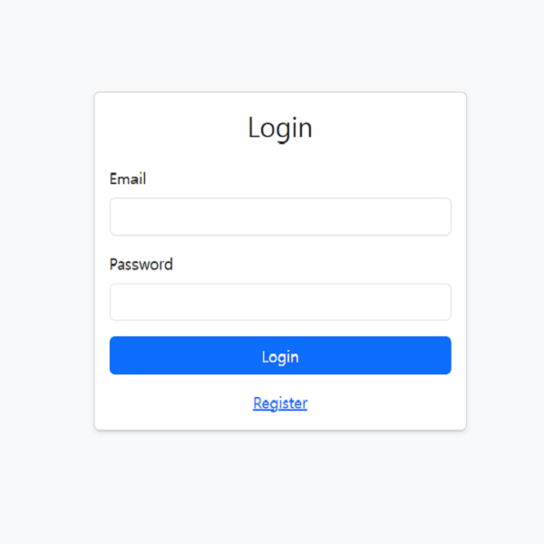
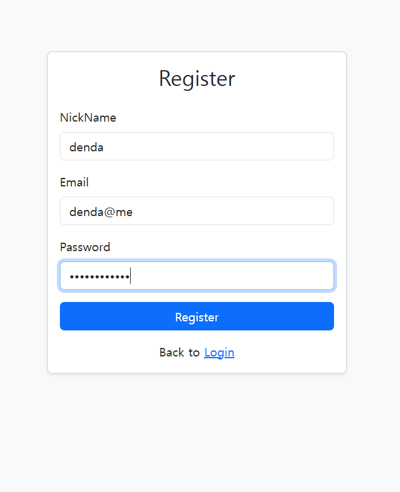
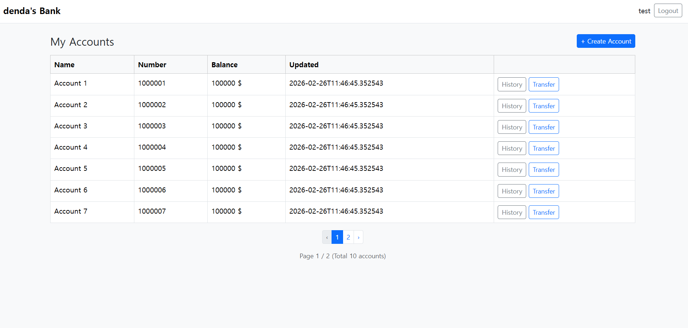
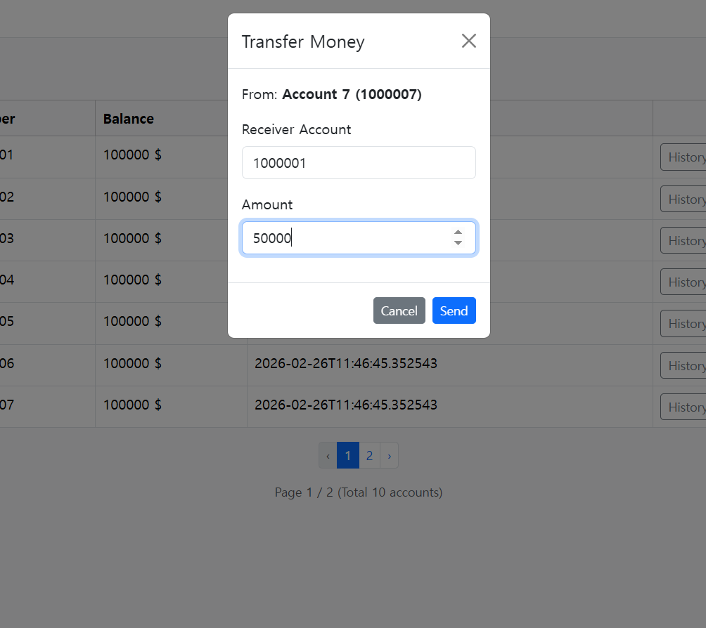
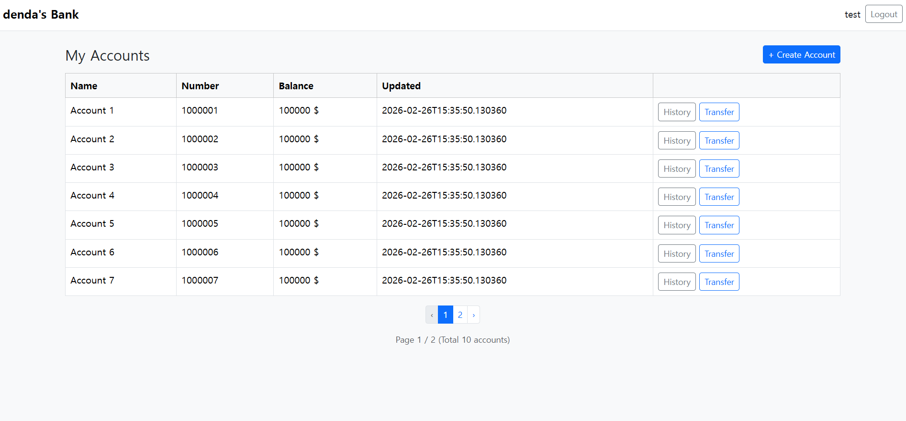
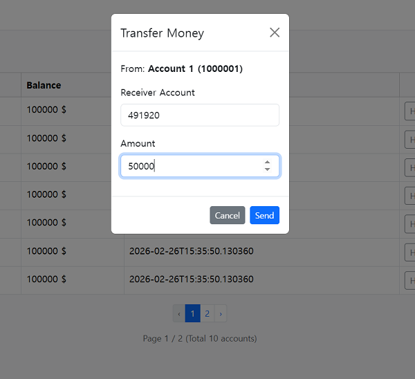
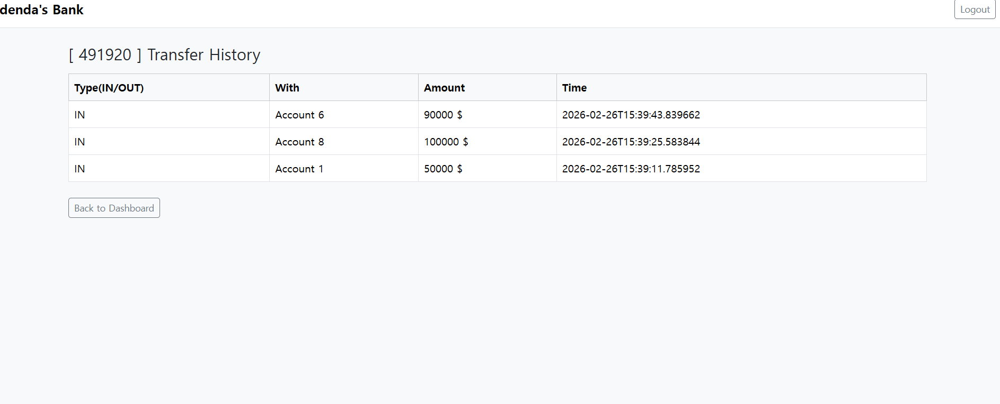

# Denda's Bank
簡単な銀行取引体験を提供するために開発されたSpring Bootアプリケーションです。

## 目次

- [主な機能](#主な機能)
- [使用技術](#使用技術)
- [APIエンドポイント](#APIエンドポイント)
- [開発詳細](#開発詳細)
- [実行方法](#実行方法)
- [使い方](#使い方)
- [写真](#写真)

## 主な機能
- ユーザー登録・認証 : 暗号化、セッションで安全に管理
- 口座開設、預金残高確認、一覧表示、振り込み
- 取引詳細の確認

## 使用技術
- Backend : Java 17, Spring Boot 4.0
- Database : PostgreSQL
- ORM : Mybatis 4.0
- Build Tool : Maven
- Test : Junit
- Frontend : HTML, Bootstrap(CSS)
- Thymeleaf

## APIエンドポイント

ユーザー
- POST /login
- POST /register
- POST /logout

口座
- POST /account/createAccount
- POST /account/{accountNumber}/transfer
- GET /account/{accountId}/history

ダッシュボード
- GET /app/dashboard

## 開発詳細

<details>
<summary>1. synchronized & 
悲観ロック : 同時実行時のデータ不整合解決　</summary>
送金処理において、データの整合性を保証するため2種類のトランザクション制御方式を実装しています。
    (1) synchronized
    (2) 悲観ロック
2つの方法のテストは BankProjectApplicationTests.java で可能です。
</details>

<details>
<summary>2. authfilterによるセッションセキュリティ認証　</summary>
フレームワークを使用せずに作成したフィルタで、HTTPリクエストオブジェクトを通じてセッションベースの認証を使用します。
</details>

<details>
<summary>3. 例外処理設計：@Controlleradviceで集約、分類　</summary>
コントローラーでのカスタム例外、ログイン、登録、DBエラー、404、500エラーを集約、分類しました。
</details>

<details>
<summary>4. クエリパフォーマンスの最適化　</summary>
ネットワークの往復最小化 : 頻繁にクエリが発生したり、2つのテーブルをまとめてクエリを送信できるように、インデックス(index)とジョイン(join)を使用するように設計しました。
</details>

## 実行方法

1. リポジトリをクローン
```sh
git clone https://github.com/denda21/bankApp.git
```

2. PostgreSQL データベースの作成
- bank_app という名前のデータベースを作成してください。
- src/main/resources/application.propertiesからデータベース設定を更新してください。

3. プロジェクトビルド
```sh
mvn clean install
```

4. アプリケーションの起動
```sh
mvn spring-boot:run
```

## 使い方

- Webブラウザで `http://127.0.0.1:8080/` にアクセス
- ユーザー登録、ログインでダッシュボードに移動
- ダッシュボードで口座をまとめて管理
- 送金で他の口座に送金
- 取引履歴で過去の送金・入金記録を確認
- data.sqlのテストユーザーでアクセスすると、すでに作成されている口座でテストが可能です。

## 写真

<details>
<summary>Click here to show the screenshots</summary>
    <p> Figure 1</p>
    
    - 
    <p> Figure 2</p>
    
    - 
    <p> Figure 3</p>
    
    -
    <p> Figure 4</p>
    
    -
    <p> Figure 5</p>
    
    -
    <p> Figure 6</p>
    
    -
    <p> Figure 7</p>
    
    -
    <p> Figure 8</p>
    
    -
</details>